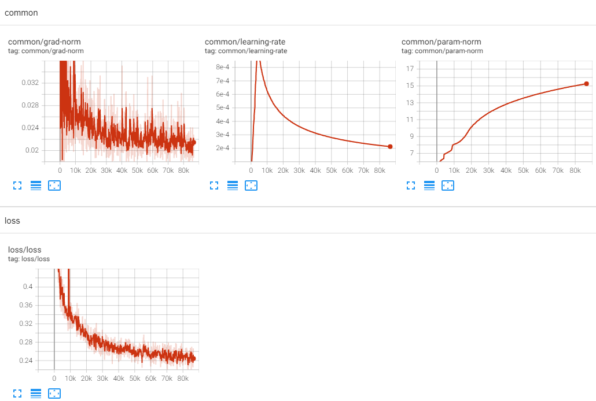
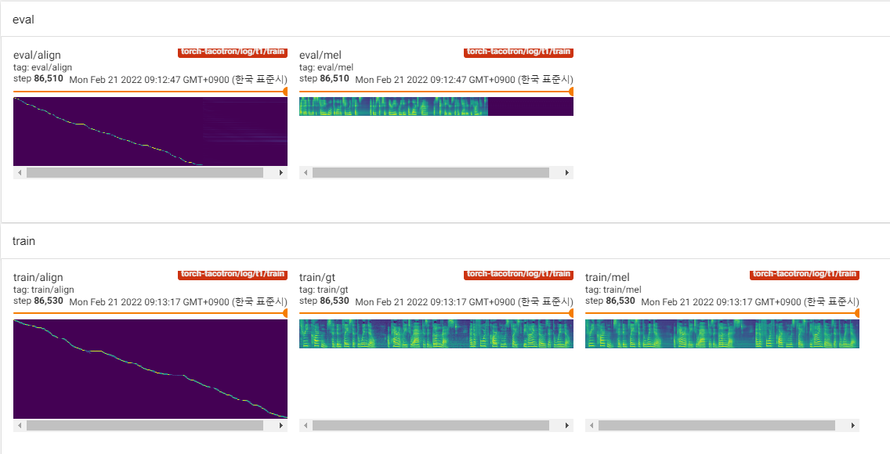

# torch-tacotron

(Unofficial) PyTorch implementation of Tacotron, Wang et al., 2017.

- Tacotron: Towards End-to-End Speech Synthesis [[arXiv:1703.10135](https://arxiv.org/abs/1703.10135)]
- Predict mel-spectrogram to use other neural vocoder.

## Requirements

Tested in python 3.7.9 ubuntu conda environment, [requirements.txt](./requirements.txt)

## Usage

Download LJSpeech dataset from [official:keithito](https://keithito.com/LJ-Speech-Dataset/)

To train model, run [train.py](./train.py). 

```bash
python train.py --data-dir /datasets/LJSpeech-1.1
```

Or dump the dataset to accelerate the train.

```bash
python -m utils.dump \
    --data-dir /datasets/LJSpeech-1.1 \
    --output-dir /datasets/LJSpeech-1.1/dump \
    --num-proc 8

python train.py \
    --data-dir /datasets/LJSpeech-1.1/dump \
    --from-dump
```

To start to train from previous checkpoint, `--load-epoch` is available.

```bash
python train.py \
    --data-dir /datasets/LJSpeech-1.1/dump \
    --from-dump \
    --load-epoch 20 \
    --config ./ckpt/t1.json
```

Checkpoint will be written on `TrainConfig.ckpt`, tensorboard summary on `TrainConfig.log`.

```bash
python train.py
tensorboard --logdir ./log
```

Inference and pretrained.
```bash
python inference.py \
    --config ./ckpt/t1.json \
    --ckpt ./ckpt/t1/t1_200.ckpt \
    --text "Hello, my name is revsic."
```

Pretrained checkpoints are relased on [releases](https://github.com/revsic/torch-tacotron/releases).

To use pretrained model, download files and unzip it. Followings are sample script.

```py
from config import Config
from taco import Tacotron

with open('t1.json') as f:
    config = Config.load(json.load(f))

ckpt = torch.load('t1_200.ckpt', map_location='cpu')

tts = Tacotron(config.model)
tts.load(ckpt)
```

## Learning Curve




## Samples

Reference [https://revsic.github.io/torch-tacotron](https://revsic.github.io/torch-tacotron).
